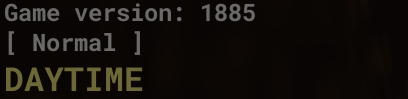
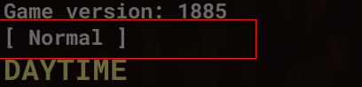
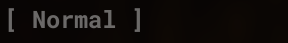

# How to use
- Make sure you have everything in requirements.txt downloaded. Run `python -m pip install -r requirements.txt` if not. (If the command doesn't work, use `python3` instead of `python`)
- This installs virtual gamepad for Anti-AFK, so follow the instructions there. (it's actually called Nefarius or something)
## Biome Bot
### Installation
You need to install tesseract before using Biome Bot. Install it [here](https://github.com/UB-Mannheim/tesseract/wiki). Just find the latest installers.
(If you're not using Windows, install tesseract like how you would for any other application.)
(Are you a MacOS user and don't know what that last line meant? Don't worry, it's `brew install tesseract`)
### Config
You need a valid bbox for this to work. (The `biome_bbox` line)

The way this works is it reads the biome line on your screen. (You don't actually need Roblox to be always focused, just make sure it isnt minimized.)

-
What you need to put on the `biome_bbox` value, is the bounding box of the biome text.

-
If everything goes well, the bot should be able to read just this part of your Roblox. 
